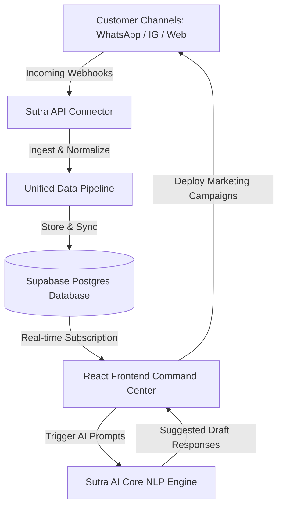

# Sutra AI – The Unified AI Operating System for Local Businesses

Sutra is an AI-powered Business Copilot and command center built specifically for local and brick-and-mortar businesses (cafes, salons, gyms, retail stores, clinics). It unifies customer interactions, reviews, messaging channels, and marketing operations into a single intelligent dashboard, reducing operational friction and helping businesses grow.

Developed for the **Take Over'26 Hackathon** (17th & 18th July 2026).

---

## 📖 Problem Statement
Local businesses today struggle with digital fragmentation. Owners must juggle multiple disjointed platforms to manage daily operations:
1. **Communication Overhead:** Customer queries are scattered across WhatsApp, Instagram Direct DMs, Website Live Chats, and Gmail.
2. **Reputational Friction:** Ratings and reviews on Google Maps/Google Business Profile go unaddressed due to lack of time.
3. **Marketing Complexity:** Designing campaigns, generating social copy, and targeting customers requires complex tools.
4. **Data Isolation:** No single source of truth connects a user's Instagram inquiry to their website visit, WhatsApp conversation, and ultimate purchase history.

---

## 💡 The Solution: Sutra AI
Sutra acts as a **unified cognitive workspace**. It connects all incoming API webhook events from popular platforms into a **Unified Inbox**, analyzes customer sentiment and purchase intent using natural language processing (NLP), provides an **AI Copilot** (ChatGPT for your shop) to draft replies and analyze metrics, and automates target audience segmentation for marketing broadcasts.

---

## 🛠️ Architecture & Data Flow
Sutra utilizes a secure, modern cloud architecture with a real-time data sync pipeline:



1. **Connector Layer:** Unifies payload JSON structures from WhatsApp Business API, Instagram DMs, Google Business Reviews, and Website widgets.
2. **Core Database:** Persists customer profiles, threads, reviews, campaigns, and configurations using Row-Level Security (RLS) on Supabase PostgreSQL.
3. **AI Pipeline:** Calculates real-time Lead Scores and Buying Intent using local NLP rules and OpenAI/Gemini models, feeding structured recommendations directly to the dashboard.

---

## 🌟 Features

### 1. Unified Inbox
* Single-feed stream consolidating WhatsApp, Instagram DMs, Gmail, Website Chat, and Google Reviews.
* Real-time platform source icons, sentiment tags, and priority labels (e.g. `HOT LEAD`, `Urgent Support`).
* **AI Suggested Replies:** Contextual draft replies ready to copy or send with one click.

### 2. Business Dashboard (Command Center)
* Displays vital daily metrics: Revenue Today, Pending Leads, Unread Messages, Missed Follow-ups, and Customer Satisfaction (CSAT).
* Overall **Business Health Score** generated dynamically based on active review ratings, response speed, and conversion rates.
* **AI Summary Panel:** A bulleted, daily summary briefing detailing today's leads and critical alerts.

### 3. AI Copilot Console
* Interactive chat interface allowing owners to query their business database using natural language.
* Preset prompts:
  * *"How is my business today?"*
  * *"Which customers should I call?"*
  * *"Generate today's Instagram post/WhatsApp Campaign"*
  * *"Show unhappy customers"*
  * *"Generate today's report"*
* Returns rich UI elements (metric cards, customer leads list, campaign draft cards) rather than text paragraphs.

### 4. Customer Journey Profiles
* 360-degree customer cards containing email, phone, timeline events, intent indicators, and lifetime revenue.
* Complete visual journey mapping user interactions from first touch (Instagram) down to review rating and repeat purchases.

### 5. Marketing Studio
* Auto-generate promotional copy for Instagram Posts, WhatsApp Broadcasts, and Email campaigns.
* Direct editable fields, one-click clipboard copying, and campaign analytics tracking.

### 6. Reviews Center
* Aggregate Google Business ratings.
* Automatic rating sentiment classification (`Positive`, `Neutral`, `Negative`, `Urgent`).
* Auto-draft responses for review management.

### 7. Integrations Hub
* Operational connection statuses for Shopify, Stripe, Razorpay, WhatsApp, Instagram, Gmail, and Google.
* Live connection status toggles and sync log monitoring.

### 8. Team Portal
* Professional profile directory showcasing the core builders and product R&D team members behind Sutra AI.

---

## 🧰 Tech Stack
* **Frontend:** React (v19) + Vite + Tailwind CSS / Vanilla HSL CSS variables
* **Database & Auth:** Supabase (PostgreSQL with RLS, pgSQL triggers, and auth helper schemas)
* **Icons & Charts:** Lucide React, Apache ECharts (`echarts-for-react`)
* **Linter & Performance:** Oxlint (Oxc parser), Rolldown/Vite asset bundle optimization

---

## 🗄️ Database Schema Setup
Sutra's schema is fully documented in [supabase_setup.sql](file:///c:/Users/ADMIN/OneDrive/goal/Desktop/Sutra/supabase_setup.sql). It defines:

1. **`profiles`**: Stores user authentication meta, business name, category, and onboarding checklist.
2. **`workspaces`**: Manages connected channels, AI description, working hours, pricing guidelines, FAQs, and setup completion status.
3. **`team_members`**: Professional profiles for directory rendering.
4. **`customers`**: Client timeline records, lead scoring, intent percentages, and overall lifetime value.
5. **`conversations` & `messages`**: Thread histories with platform channel markers and sender contexts.
6. **`reviews`**: Rating logs and reply states.
7. **`campaigns`**: Drafted and active marketing copy.
8. **`notifications`**: Real-time alerts based on system webhooks.
9. **`analytics`**: Performance logs tracked over days/weeks.
10. **`integrations`**: Hook connections.

To configure the tables, run the SQL script in your **Supabase SQL Editor** and click **Run**.

---

## 🚀 Installation & Local Setup

### 1. Prerequisites
Ensure you have [Node.js](https://nodejs.org/) (v18+) and `npm` installed.

### 2. Clone the Repository & Install Dependencies
```bash
npm install
```

### 3. Setup Environment Variables
Copy `.env.example` to `.env`:
```bash
cp .env.example .env
```
Open `.env` and fill in your Supabase connection parameters:
```env
VITE_SUPABASE_URL=https://your-project-id.supabase.co
VITE_SUPABASE_ANON_KEY=eyJhbGciOiJIUzI1NiIsInR5cCI6IkpXVCJ9...
```

### 4. Run the Dev Server
```bash
npm run dev
```
Open [http://localhost:5173/](http://localhost:5173/) to view the application.

---

## 🌐 Deployment
* **Hosting:** Vercel / Netlify
* Ensure your `.env` variables (`VITE_SUPABASE_URL` and `VITE_SUPABASE_ANON_KEY`) are added in your hosting provider's Environment variables settings during build.
* Production build command:
  ```bash
  npm run build
  ```

---

## 👥 Meet the Team
* **Karthik Nimmanagoti** - Founder & Product Manager
* **Y. Ahladini Sindhu Sri** - Research & Development Lead
* **Dornala Amrutha Varshini** - Frontend Developer

---

## 📄 License
This project is licensed under the MIT License - see the LICENSE file for details.
